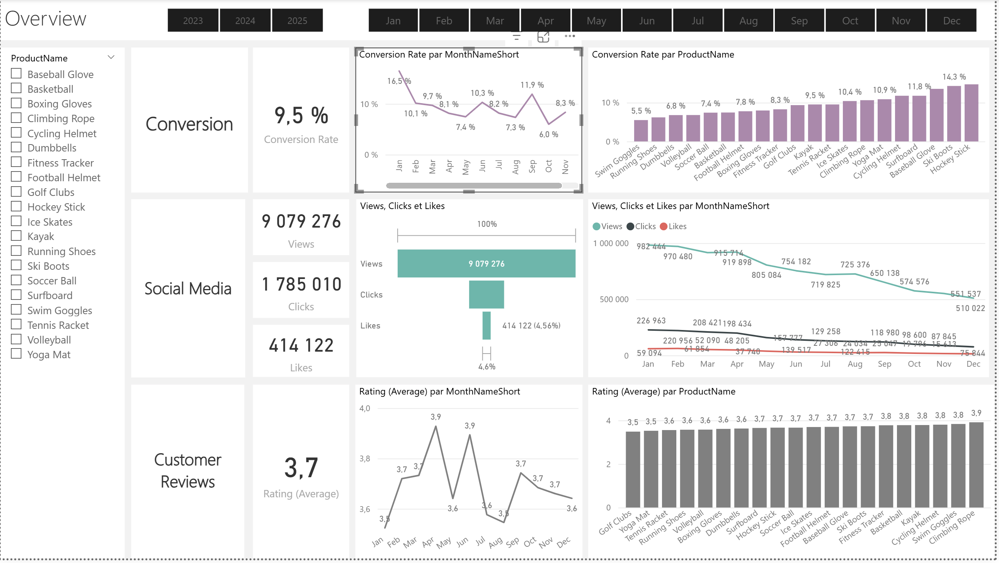

# 🚀 360° Marketing Analytics & Sentiment Analysis Pipeline

An End-to-End Business Intelligence project transforming raw marketing data into actionable insights using **SQL**, **Python (NLP)**, and **Power BI**.

## 📋 Project Context
The goal of this project was to centralize scattered marketing data to track customer journeys, analyze product performance, and understand customer sentiment. The solution involves a full data pipeline: from extraction and cleaning to advanced AI enrichment and interactive reporting.

## ⚙️ Technical Architecture

### Phase 1: Data Engineering & Cleaning (SQL)
Raw data was extracted and transformed using advanced SQL techniques to ensure data quality before analysis.
*   **Customer Journey:** Deduplication of records using **CTEs** (Common Table Expressions) and `ROW_NUMBER()`. Handling missing duration values via `COALESCE` and sub-queries.
*   **Products:** Creation of price segments (`Low`, `Medium`, `High`) for categorical analysis.
*   **Engagement:** Standardization of content types and date formatting.
*   **Customers:** Denormalization via `LEFT JOIN` to combine Customer and Geography tables.

### Phase 2: AI-Powered Sentiment Analysis (Python)
To go beyond simple star ratings, I developed a Python script to analyze the textual content of customer reviews.
*   **Library:** Used **NLTK** (Natural Language Toolkit) for Natural Language Processing.
*   **Logic:**
    *   Cleaning text (removing double spaces, special characters).
    *   Calculating a **Sentiment Score** (from -1 to +1).
    *   Categorizing reviews into buckets (e.g., "Mixed Negative", "Strongly Positive").
*   **Output:** An enriched dataset ready for correlation analysis in Power BI.

### Phase 3: Interactive Dashboard (Power BI)
The final layer is a multi-page report designed for stakeholders.
*   **Data Modeling:** Implementation of a **Star Schema** with Fact tables (Reviews, Engagement) and Dimension tables.
*   **DAX Measures:** Complex calculations for **Conversion Rate**, running totals, and dynamic time intelligence.
*   **Key Visualizations:**
    *   📉 **Conversion Funnel:** Visualizing the drop-off from "View" to "Purchase".
    *   ⭐ **Sentiment Analysis:** Scatter plots correlating ratings with sentiment scores.
    *   🗺️ **Geographic Distribution:** Sales performance by region.

## 📂 Repository Structure
- `customers.sql`, `products.sql`, etc. : SQL extraction logic.
- `customer_reviews_enrichment.py` : The NLP script for sentiment scoring.
- `Dashboard.pdf` : A PDF export of the final report.

## 🚀 Key Results
- **Full Visibility:** Unified view of the customer journey from social media engagement to final purchase.
- **Improved Insights:** The Sentiment Analysis module revealed specific pain points hidden in 3-star reviews.
- **Automation:** Replaced manual Excel reporting with an automated data flow.

---
*Tools used: SQL Server, Python, Pandas, NLTK, Power BI Desktop.*
